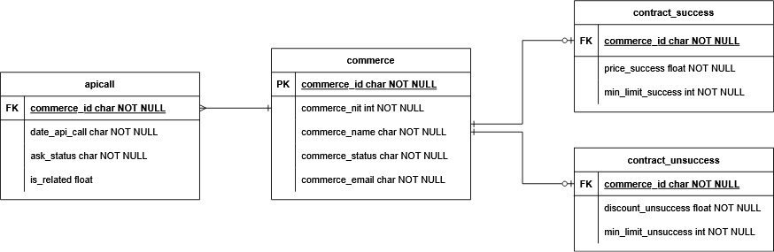

# ETL Facturación de API
 
Este repositorio esta dedicado a la prueba técnica para la vacante de Ecosistemas de Bancolombia desarrollado en la versión de Python 3.12.3, se trata de un sistema de facturación de una API y permite a los usuarios seleccionar empresas para facturación y filtrar la información por un rango de tiempo determinado.
 
---
 
## Entradas
 
### 1️⃣ Selección de empresas
Permite al usuario definir qué empresas incluir en la facturación. Se presentan cuatro opciones:
 
- **0. Todas las empresas Activas** → Se seleccionan todas las empresas activas en la base de datos.
- **1. Todas las empresas Inactivas** → Se seleccionan todas las empresas inactivas.
- **2. Seleccionar una empresa** → Muestra una lista de empresas y permite elegir una específica.
- **3. Seleccionar varias empresas** → Muestra una lista de empresas y permite elegir varias ingresando los números correspondientes separados por espacios.
 
### 2️⃣ Filtrado por fecha
Filtra los registros de llamadas (`apicall`) según el rango de fechas definido por el usuario. Se presentan tres opciones:
 
- **0. Año/Mes** → Filtra los datos por un año y mes específicos.
- **1. Año** → Filtra todos los datos de un año en particular.
- **2. Todo el histórico** → No se aplica ningún filtro de fecha, usando todos los registros.
 
---
## Funcionamiento
 
### **Proceso**
1. Se construye una consulta SQL con filtros según la opción elegida.
2. Se ejecuta la consulta sobre la base de datos.
3. Se devuelve un `DataFrame` con los registros filtrados.
4. Se realiza el proceso de transformación de los datos.
5. Se guarda un excel con la factura localmente.
6. Se envía correo de la ejecución de la rutina.
 
### **Ejecución**
Para ejecutar el proyecto en Windows se debe tener instalado Python y ademas seguir los siguientes pasos.
```bash
git clone https://github.com/juan-quirozt/prueba_batsej.git
cd prueba_batsej
python -m venv venv
venv/Scripts/activate
pip install -r requirements.txt
python ejecucion.py
```

Para ejecutar los test ejecutar el siguiente comando
```bash
pytest
# O alternativamente
python -m unittest discover
```

### **Manejo de Cobros y Descuentos**
Para manejar los contratos de las empresas sin modificar el código
cuando una nueva empresa es añadida, se ha optado por crear dos nuevas tablas.

Se crea un registro por cada rango a cobrar o realizar descuento.
Ejemplo:

| commerce_id         | price_success | min_limit_success |
|---------------------|--------------|-------------------|
| Vj9W-c4Pm-ja0X-fC1C | 250          | 0                 |
| Vj9W-c4Pm-ja0X-fC1C | 200          | 10000             |
| Vj9W-c4Pm-ja0X-fC1C | 170          | 20000             |

Esto se traduce en que la empresa tiene tres tarifas:

* En (0, 10000): se cobra a 250
* En (10000, 20000): se cobra 200
* Para valores mayores a 20000 se sobra a 170

Si la empresa tiene una única condición de cobro el límite inferior es cero.

| commerce_id         | price_success | min_limit_success |
| KaSn-4LHo-m6vC-I4PU | 300          | 0                 |


`contract_success`: Contiene las condiciones de los cobros por llamados exitosos

Columnas:
* `commerce_id`: Indicador único de cada empresa
* `price_success`: Tarifa que se debe cobrar en el rango (se incluye el límite inferior)
* `min_limit_success`: Límite inferior del rango para el cual aplica la tarifa


`contract_unsuccess`: Contiene las condiciones de los descuentos por llamados no exitosos

Columnas:
* `commerce_id`: Indicador único de cada empresa
* `discount_unsuccess`: Descuento porcentual que se debe aplicar en el rango (se incluye el límite inferior)
* `min_limit_success`: Límite inferior del rango para el cual aplica el descuento

A continuación se presenta un diagrama Entidad-Relación que describe la estructura de la Base de Datos:

